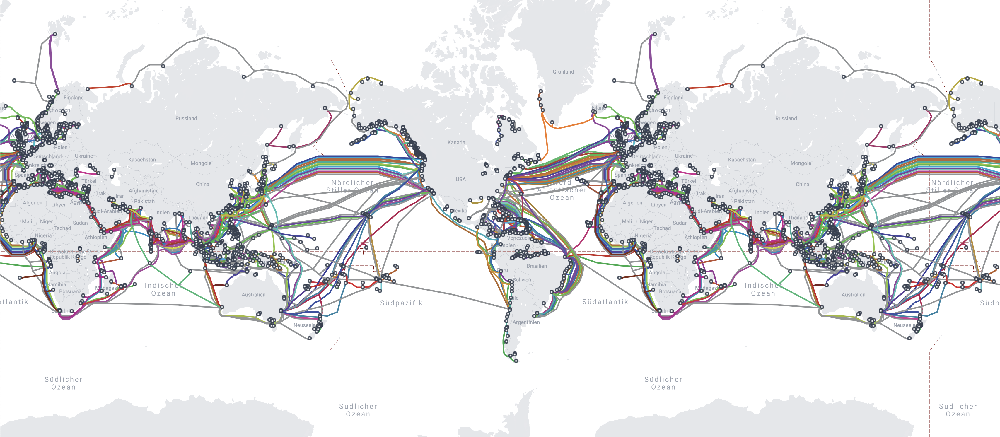
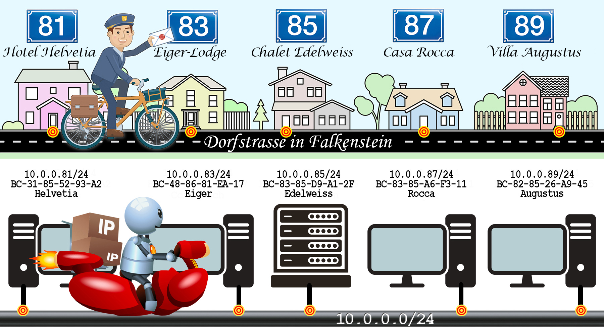
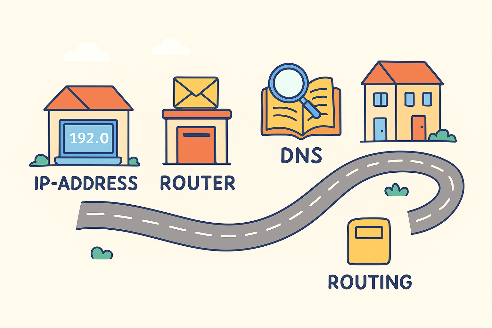

## Willkommen zur zweiten Lektion 
 

### 📋 **Heutiger Ablauf**  
| Zeit | Inhalt | Was machen wir? |
|------|---------|-----------------|
| 09:30 | 🧏‍♀️  Ankommen | kurzer Austausch |
| 09:45 | 🌐 Einstieg Internet Grundlagen| siehe Unterlagen |
| 10:15 | ☕ Kaffeepause | Zeit zum Austausch |
| 10:30 | 💻 Übung  | Verbindungen prüfen |
| 11:15 | 📝 Zusammenfassung | Was haben wir gelernt? |
| 11:30 | ✅ Ende  |

  

## Internet Grundlagen

### weltweite physische Verkabelung

- Es gibt über 500 aktive Kabel mit zusammen über 1,5 Millionen km Länge.
- Die meisten verlaufen:
- Transatlantik: zwischen Europa und USA.
- Transpazifik: zwischen Asien und USA.
- Indischer Ozean: Verbindung Europa ↔ Indien ↔ Südostasien.
- Afrika wird aktuell mit dem riesigen Projekt 2Africa rundum erschlossen.
  
### Kabellose Datenübertragung
- Mobilfunkantennen
- Router: 
  - zb physische Setup Box von Swisscom, Sunrise oder der entsprechenden Firma, wo man das Abo bezieht.
  - WLAN Router: wandelt das physische in ein wireless Signal um. Oft ist in der Setupbox ein wlan router integriert, kann man aber auch separat bzw zusätzlich installieren, wenn man zb schlechte WLAN Abdeckung zu Hause hat.
  
### GPS oder Satellitenübertragung
- Das ist quasi wie Mobilfunkantennen global. Die Satelliten im Weltraum übertragen die Signale ebenfalls kabellos
  

### 🗺️ Übersicht: Internet-Routing, IP, DNS – einfach erklärt
 

- 
 

## 1. IP-Adresse – die Hausnummer im Internet

- Jeder Computer/Handy hat eine IP-Adresse = wie eine Hausnummer in  einer Stadt.
- Beispiel: 192.168.0.5 (privat im Heimnetz) oder 91.198.174.192 > (Wikipedia öffentlich).

👉 Analogie:
- Straße = Netzwerk
- Hausnummer = IP
- Postbote = Router

## 2. Router – der Postverteiler
- Dein Heimrouter (z. B. Swisscom-Box, Sunrise) verteilt die Pakete an die richtigen Geräte.
- Er weiß: „Das Paket für Astrids Laptop geht hierhin, das für den Drucker dorthin.“

👉 Analogie: Postamt in der Nachbarschaft.

## 3. DNS – das Telefonbuch des Internets
- Menschen merken sich Namen wie wikipedia.org, nicht Zahlen.
- DNS übersetzt: wikipedia.org → 91.198.174.192.

👉 Analogie: Du wählst im Handy „Anna“, und das Telefon sucht automatisch ihre Nummer heraus.

## 4. Routing – die Reiseroute der Daten
- Daten reisen in kleinen Päckchen von Router zu Router, bis sie am Ziel sind.
- Jeder Router schaut: „Welcher Weg ist am schnellsten?“ – so ähnlich wie Google Maps für Daten.
- Es gibt nicht nur einen Weg, sondern viele (falls mal ein Kabel „gesperrt“ ist).

👉 Analogie: Autofahrt mit Navi – manchmal Stau, dann wird umgeleitet.

⸻

## 5. Zusammenfassung
- Dein Laptop (Hausnummer) → Router zuhause (Postamt) → Provider (Autobahnauffahrt) → Unterseekabel (Flugzeug) → Ziel-Server (Haus in einer anderen Stadt).
- DNS ist dabei das Adressbuch, ohne das man die Hausnummer gar nicht wüsste.
 

⸻

Quellen:

- [Netzwerkrouting mit tiefergehenden details erklärt von Jürg Arnold](https://edu.juergarnold.ch/tcpipstack.html)

fixe Links 

- [🪟 Windows 10 ESU - gut zu wissen](/unterlagen/grundkurs-2025-10-02-di/assets/Win10ESU.md){.download-link}

